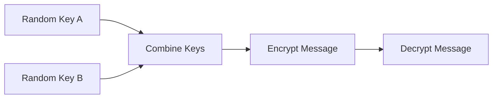

# Hybrid Security Demo

A minimal Python script that walks through a **hybrid key agreement** flow. It
- simulates **QKD** by generating a fresh random symmetric key,
- simulates a **post‑quantum key exchange** step by encrypting a session key with an RSA key pair (standing in for a lattice-based KEM),
- XORs the two derived secrets to produce a final hybrid key,
- then uses the hybrid key for an AES‑EAX encrypt/decrypt of a sample message.

The code is intentionally simple but illustrates how multiple primitives might be combined in a post‑quantum aware protocol.



## 📂 Structure

```
hybrid-security-qkd-pqc/
├── README.md
├── requirements.txt
└── hybrid.py
```

## 🚀 Usage

```bash
python hybrid.py
```

## 📜 License

MIT License
