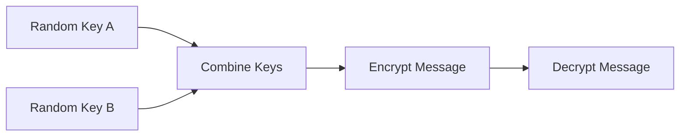

# Hybrid Security Demo

A minimal script that simulates hybrid encryption by combining two random keys and encrypting a message with AES.



## 📂 Structure

```
hybrid-security-qkd-pqc/
├── README.md
├── requirements.txt
└── hybrid.py
```

## 🚀 Usage

```bash
python hybrid.py
```

## 📜 License

MIT License
