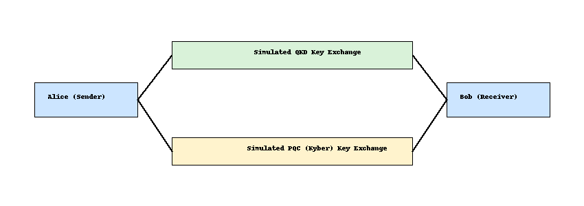

# Hybrid Security: QKD + PQC 🔐⚛️

This project demonstrates a simulated hybrid encryption model using:
- Quantum Key Distribution (QKD) for physical link simulation
- Post-Quantum Cryptography (PQC) for endpoint security

## 🧠 Concept

1. QKD is simulated to exchange raw entropy keys securely (used as part of key material).
2. PQC (Kyber-style) is simulated to derive a secure shared key.
3. A hybrid key is generated using both QKD and PQC results.
4. AES is used to encrypt and decrypt messages using the hybrid key.

## 📁 Structure

- `src/qkd.py` – Simulates QKD key agreement
- `src/pqc.py` – Simulates PQC key exchange (Kyber-style)
- `src/hybrid_encrypt.py` – Hybrid encryption/decryption logic
- `architecture.png` – Visual overview of the hybrid encryption system

## 🔧 Requirements

```bash
pip install pycryptodome
```

## 🚀 Usage

```bash
python src/hybrid_encrypt.py
```

This will simulate key generation, hybrid encryption, and message decryption.

## 📊 Architecture


