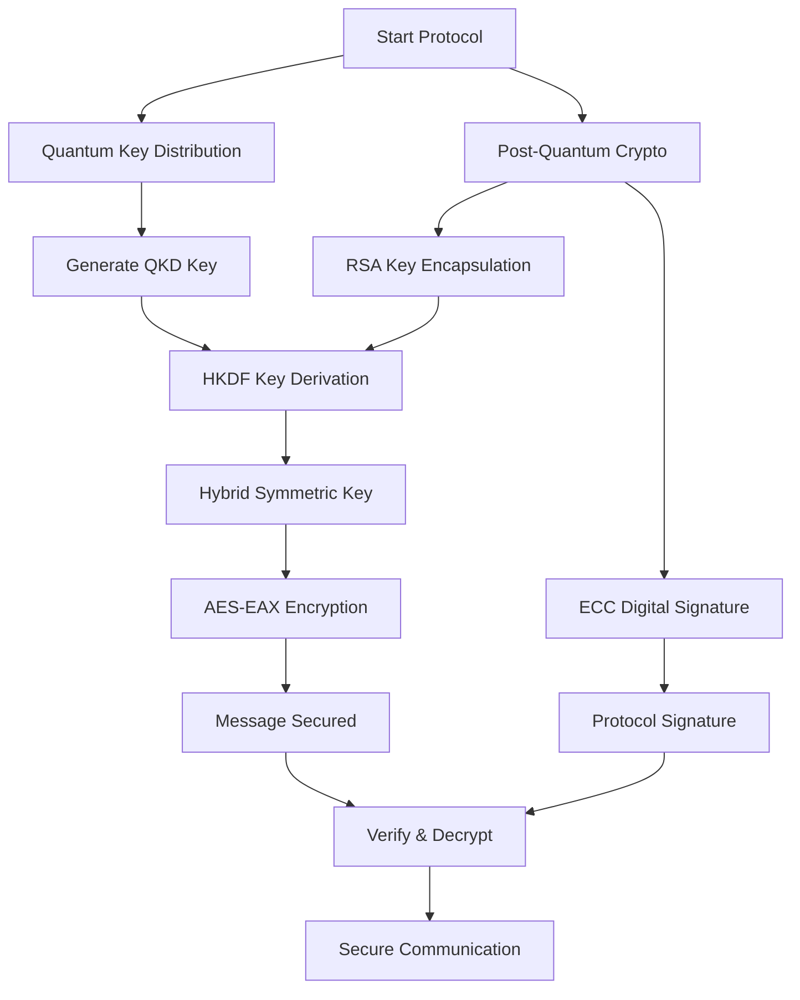

# Hybrid Security QKD + PQC Demo

A comprehensive simulation of hybrid quantum-safe cryptography combining Quantum Key Distribution (QKD) with Post-Quantum Cryptography (PQC). The script demonstrates a complete key exchange protocol with RSA-KEM, ECC signatures, and AES encryption.



## 📂 Structure

```
hybrid-security-qkd-pqc/
├── README.md
├── requirements.txt
├── hybrid.py  # Full hybrid protocol simulation with classes and crypto
```

## 🚀 Usage

```bash
python hybrid.py
```

Runs the complete hybrid key exchange and demonstrates secure message encryption/decryption.

## 🏗️ Protocol Phases

- **QKD Phase**: Simulates quantum-secure key generation
- **PQC Phase**: RSA-KEM for key encapsulation + ECC for signatures
- **Hybrid Phase**: Combines keys using HKDF-like derivation
- **Encryption Phase**: AES-EAX symmetric encryption with hybrid key

## 📜 License

MIT License
