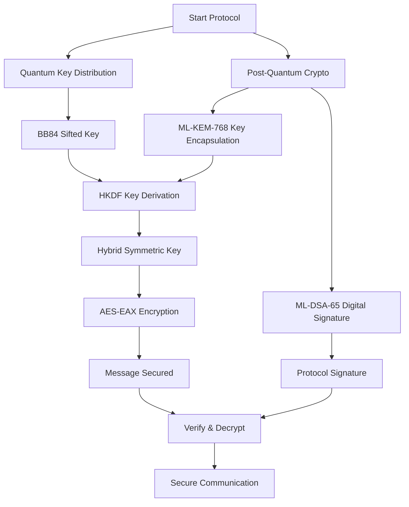

# Hybrid Security QKD + PQC Demo

A comprehensive simulation of hybrid quantum-safe cryptography combining Quantum Key Distribution (QKD) with Post-Quantum Cryptography (PQC). The script demonstrates a complete key exchange protocol with ML-KEM-768 (Kyber) key encapsulation, ML-DSA-65 (Dilithium) signatures, and AES encryption.


```mermaid
flowchart TD
    Start[Start Protocol] --> QKD[Quantum Key Distribution]
    Start --> PQC[Post-Quantum Crypto]

    QKD --> GenerateQKD[BB84 Sifted Key]
    PQC --> ML_KEM[ML-KEM-768 Key Encapsulation]
    PQC --> ML_DSA_Sign[ML-DSA-65 Digital Signature]

    GenerateQKD --> CombineKeys[HKDF Key Derivation]
    ML_KEM --> CombineKeys

    CombineKeys --> HybridKey[Hybrid Symmetric Key]
    HybridKey --> AESEncrypt[AES-EAX Encryption]

    AESEncrypt --> MessageEncrypted[Message Secured]
    ML_DSA_Sign --> Signature[Protocol Signature]

    MessageEncrypted --> Verify[Verify & Decrypt]
    Signature --> Verify

    Verify --> End[Secure Communication]
```

## 📂 Structure

```
hybrid-security-qkd-pqc/
├── README.md
├── requirements.txt
├── hybrid.py  # Full hybrid protocol simulation with classes and crypto
```

## 🚀 Usage

```bash
python hybrid.py
```

Runs the complete hybrid key exchange — both parties derive the same hybrid key — and demonstrates secure message encryption/decryption.

## 🏗️ Protocol Phases

- **QKD Phase**: Simulates BB84 quantum key distribution (random bases, sifting) over an ideal channel
- **PQC Phase**: ML-KEM-768 (Kyber) for key encapsulation + ML-DSA-65 (Dilithium) for signatures — NIST post-quantum standards, pure-Python via `kyber-py` and `dilithium-py`
- **Hybrid Phase**: Combines the QKD and KEM secrets using HKDF-like derivation
- **Encryption Phase**: AES-EAX symmetric encryption with hybrid key

## 📜 License

MIT License
